[image1]: ./output_images/calibration.jpg
# Advanced Lane Finding

With in this project some of the more advanced topics from the computer vision context is used to detect the lane lines in a video stream. The outline of the project is as follows:

### 1. Camera Calibration
### 2. Image Correction
### 3. Color Threshold
### 4. Gradient Threshold
### 5. Combining the Color and Gradient Threshold
### 6. Bird's-eye View
### 7. Lane Detection in a Single Image
### 8. Lane Detection in a Video Stream

In the next following paragraphs I will be explaining each of the topics in detail.

## 1. Camrera Calibration
The pin hole camera model is an ideal camera model, but is reality the cameras are equipped with lenses that may induce unwanted errors and distortions to the image. Therefore, the distortions should be corrected to have a better lane detection algorithm. Moreover, the curvature of the lanes will be also effected by the lens distortions. In order to correct the lens distortions the camera should be calibrated.

**Calibration Method:** The calibration starts with detecting corners in images from chessboard taken from different camera pose and location. Because the chessboard is not moving, the corresponding corners can be used to acquire the calibration parameters including the correction matrix. Figure below shows some of the examples of the calibration images with detected corners plotted on them.

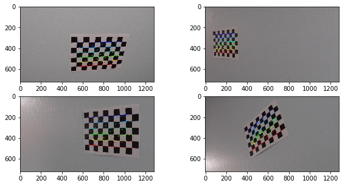

## 2. Image Correction

After obtaining the calibration parameters (distortions coefficients and calibration matrix), the original images can be corrected (undistorted). The image correction is important to obtain a reliable lane detection pipeline. Figures below shows the corrected images. The first set is from the calibration images, this figure clearly shows that how the distortions are corrected.

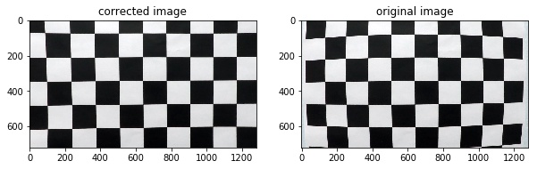

Figure below is one of the test images, which is corrected using the same camera calibration parameters.

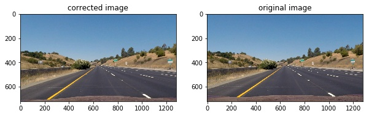

## 3. Color Threshold

After calibrating the camera and correcting the distortions in the original image, it is essential to isolate the lane lines by means of applying several thresholds and filtering techniques. Because the lane line often have unique color properties, color threshold can be good approach to isolate the lanes from the rest of the pixels in the image. In this project, I used the HLS color space to apply the color threshold. Figure below shows the different channels of the HLS representation of the image.

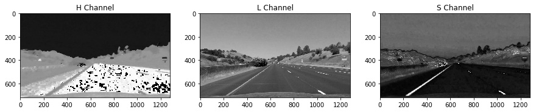

I will be using the S channel to apply the threshold, and obtain the binary image. Figure below shows the result after applying a threshold to the S channel.

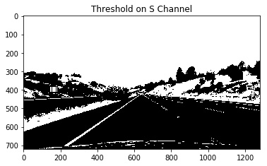

## 4. Gradient Threshold

Other than color threshold, the gradient of the image can also provide useful information regarding the pixels associated with the lane lines. Figure below shows gradient of the gray scale image in x and y direction along with the gradient magnitude and gradient direction.

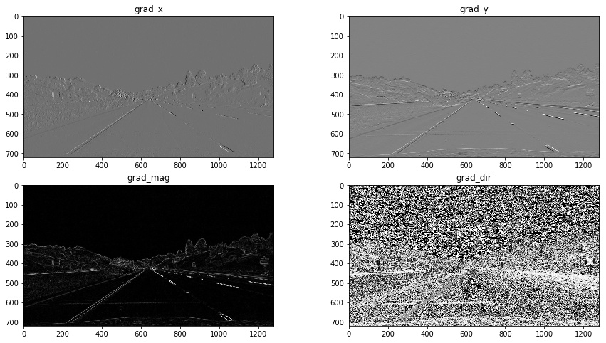

I applied the threshold to all four gradient images and then combined them to get a final binary image. This has been implemented in the function **grad_thresh** in the My_Functions.py file. The threshold value are selected by trial and error. The final binary image obtained from applying threshold to gradient image is as below:

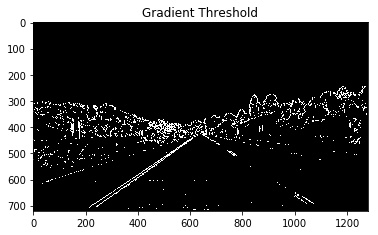

## 5. Combining the Color and Gradient Threshold

The binary image obtained from the gradient threshold can be combined with the binary image from the color space threshold to get a more robust pipeline. The resulting final binary image is shown as below, as it is clear the binary images are combined with an **or** operation.

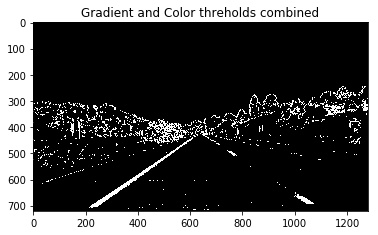

## 6. Bird's-eye View

Normally the camera will be placed in front of the car. However, having a bird eye view from the top is much more helpful for detecting lane lines. The bird's eye view can be obtained by applying a prespective transformation to the original images from the camera.

In order to find the desired perspective transformation four points on a trapezoid will be selected as the source points. These four points will form a rectangle in the bird eye view, which will be considered as the destinations points. This operation is encapsulated in the function **warp** in the My_Functions.py file. This function get the undistorted image as its input and provides the bird eye view of the image along with the inverse transformation matrix which is essential in the next stages of the pipeline. Figure below shows the formation of the bird's eye view along with the source and destination points.

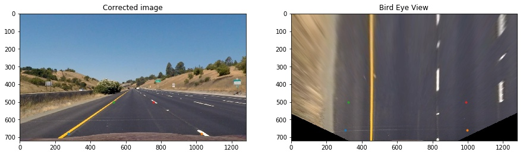

## 7. Lane Detection in a single image

At this point, the binary image is available from the color space and gradient threshold. This binary image can be projected to the bird's eye view which will be called the **binary_wraped** image. The figure below shows an example of the **binary_wraped** for one of the test images.

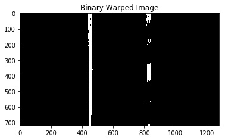

Once the binary_warped image is formed the left and right lane should be distinguished first. This process has been expalained in the lane detection lessons throughly;therefor, I will be just pointing them out.

1- The histogram of the pixels for the lower half of the image is formed and the location of the left and right lane can be estimated based on the location of the peaks in the histogram.

2- The histogram can provide a rough estimation of the location of the lanes as a starting point. For a better estimation, I used the sliding window method from the lessons to obtain a better estimation of the pixels that are corresponding to the lane lines.

3- After detecting the pixels that are corresponding to the left and right lanes a second order polynomial is fit to the pixels.

4- The curvature of the detected second order polynomial is estimated using the function **Lane_Curveture**. Moreover, the deviation of the car from the center of the road is measured with the function **center_offset**.

These steps are implemented in the **Image_Lane_detection**. This function gets the binary_warped image as the input and fit the second order polynomial to the lane lines. Figure Below shows the output of this function.

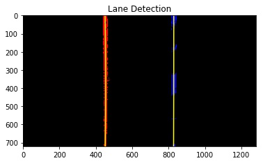

Once the left and right lanes are detected on the bird eye view the lines can be transformed back to the original image. As shown below.

**IMAGE_PROCESS function:**
I have encapsulated all of the previous steps and stages in a function named **IMAGE_PROCESS**. This function takes an RGB image as the input and gives back the annotated image where the lane lines are detected. Figure below shows the final output of lane detection and image captioning for all the test images. As it is clear, the lane detection pipeline is performing reasonably well on the test images.

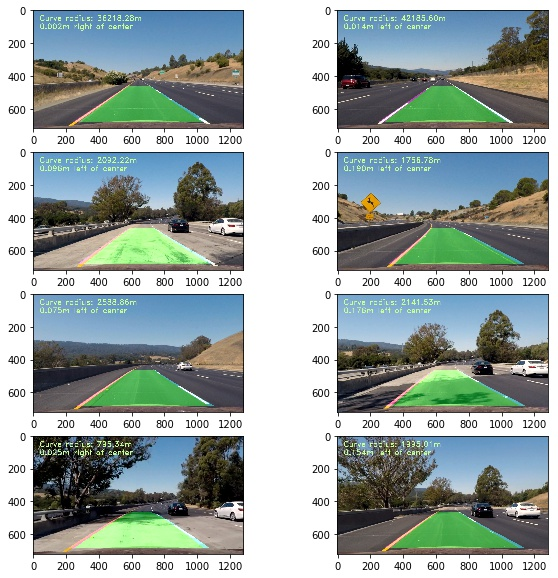

## 8. Lane Detection in a Video Stream

In the previous sections, the lane detection pipeline for individual images were discussed. The lane detection in a video stream is the same with some slight additions, which are pointed out here.

1- A video stream is a sequence of images therefore the lane detection on images can be applied to each of the frames.

2- In detecting the lane lines in video stream the searching window for the location of the lane pixels can be restricted based on the previous detected lane line, which can increase the speed and accuracy of the pipeline.

3- The detected lane line can be averaged over couple of frames in order to achieve a better and more stable pipeline. Moreover, the fits for lane line can be rejected by comparing to the previous detection, this can be very useful for frame that the lane detection is not performing well (Bad frames).

All the above-mentioned points are implemented in the function named **VIDEO_PROCESS** in My_Functions.py file.

The result of my lane detection pipeline on video stream is in the [Video Link](./My_Video.avi).

## Discussion:

In this section I will be pointing out some the most important challenges for designing a robust lane detection pipeline.

1- The threshold value should be selected carefully and it requires several trial and errors to find the suitable values. Having a more dynamic thresholding approach can definitely improve the performance.

2- The lane detection on some the frames of the video is hard. Therefore, rejecting the bad detection is very essential for the pipeline to perform well.

3- Smoothing the lane lines over the last couple of frames was also very helpful to improve the pipeline.

4- Shadows were often the most challenging effect on the images. Combining several color space thresholds seems to be a good option to overcome this challenge, which I will be considering to implement in future.
