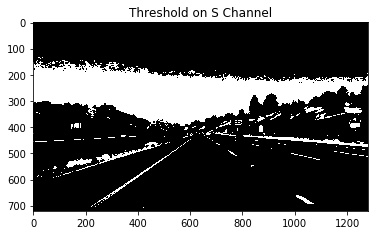
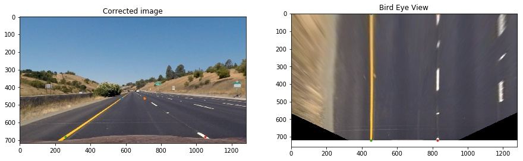

[image1]: ./output_images/calibration.jpg
# Advanced Lane Finding
With in this project some of the more advanced topics from the computer vision is used to detect the lane line in a video stream. The outline of the project is as follows:

### 1. Camera Calibration
### 2. Image Correction
### 3. Color Threshold
### 4. Gradient Threshold
### 5. Combining the Color and Gradient Threshold
### 6. Bird's-eye View
### 7. Lane Detection in a single image
### 8. Lane Detection in a Video Stream

In the next pragraphs I will be expailning each of the topics in detail.

## 1. Camrera Calibration
The pin hole camera model is an ideal camera model, but is reality the camera's are equiped with lenses that may induce unwanted errors and distorsions to the image. Therefore, the distorsion should be corrected to have a better lane detection algorithm. Moreover, the curveture of the lanes will be also effected by the lens distorsions. In order to correct the lens distorsions the camera should be calibrated.

**Calibration Method:** The calibration starts with detecting corners in images from chessborade taken from different camra pose and location. Because the chessborad is not moving the corresponding corners can be used to aquire the calibration parameters including the correction matrix. Figure below shows some of the examples of the calibration images with detected corners ploted on them.

## 2. Image Correction

After obtaining the caliration parameters (distorsion coefficients and calibration matrix) the original images can be corrected (undistored). The image correction is important to obtain a reliable lane detection pipeline. Figures below shows the corrected images. The first set is from the calibration images, this figure clearly shows that how the distorsions are corrected.

Figure below is one of the test images which is corrected using the same camera calibration parameters.

## 3. Color Threshold

After calibrating the camera and correcting the distorsions in the original image it is essential to isolate the lane lines by means of applying several thresholds and filtering thechniques. Because the lane line often have uniqe color properties color threshold can be good apprach to isolate the lanes from the rest of the pixels in the image. In this projetc I used the HLS color space to apply the color threshold. Figure below shows the different channels of the HLS representation of the image.

I will be using the S channel to apply the threshold, and obtain the binay image. Figure below shows the result after applying a threshold to the S channel.

## 4. Gradient Threshold

Other than color threshold the gradient of the image can also provide useful infomration regarding the pixels associated with the lane lines. Figure below shows gradient of the gray scale image in x and y direction along with the gradient magnitude and it's direction.

I applied the threshold to all four gardient images and then combined them to get a final binary image. This has been implemented in the function **grad_thresh** in the My_Functions.py file. The threshold value are selected by trial and error. The final binary image obtained from applying threshold to gradient image is as below:

## 5. Combining the Color and Gradient Threshold

The binary image obtained from the graident threshold can be combined with the binary image from the color space threshold to get a more robust pipeline. The resulting final binary image is shown as below, as it is clear the binary images are combined with an **or** operation.

## 6. Bird's-eye View

Normally the camera will be placed in front of the car. However, having a bird eye view from the top is much more helpful for detecting lane lines. The bird's eye view can be obtained by applying a prespective transformation to the original images from the camera.

In order to find the desired prespective transformation four points on a trapazoid will be selected as the source points. These four points will form a rectangle in the bird eye view which will be considered as the destinations points. This operation is encapsulated in the function **warp** in the My_Functions.py file. This function get the undistorted image as its input and provides the bird eye view of the image along with the inverse transfomration matrix which is essential in the next stages of the pipeline. Figure below shows the formation of the bird's eye view along with the source and destination points.

## 7. Lane Detection in a single image

At this point the binary image is available from the color space and gradient thresholding. This binary image can be projected to the bird's eye view which will be called the **binary_wraped** image. The figure below shows an example of the **binary_wraped** for one of the test images.

# 8. Lane Detection in a Video Stream
